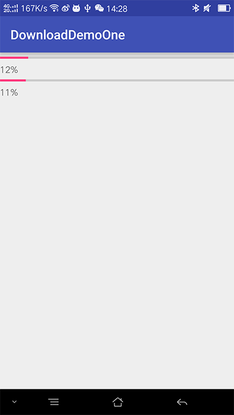
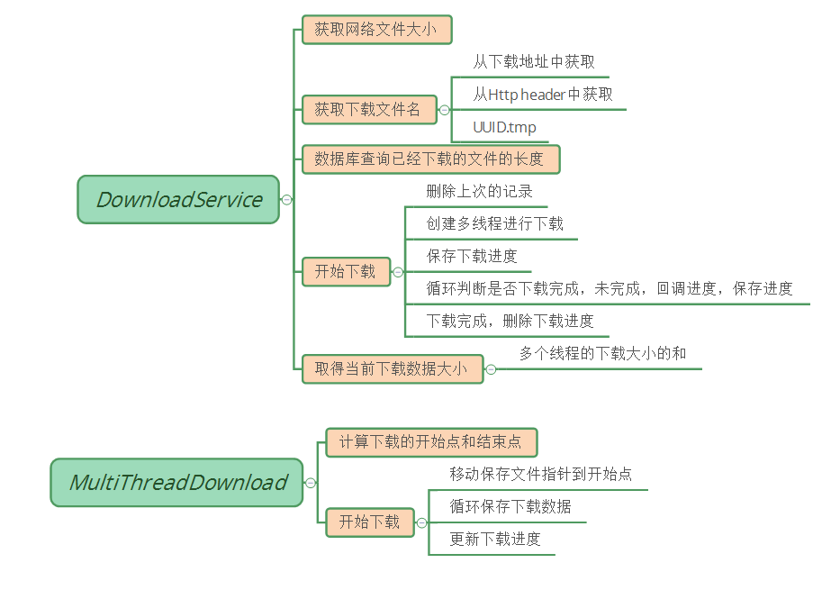

> 下载续传调研

# 一、多文件同时下载，进度显示

参考地址:

- [android 多线程断点续传下载 一](http://blog.csdn.net/shimiso/article/details/6763664)


范例一DownloadOneActivity



每个文件都的下载都是单独的线程，下载的时候计算进度，UI进度显示。

进度计算

```java
 URL fileUrl = new URL(this.url);
                HttpURLConnection conn = (HttpURLConnection) fileUrl
                        .openConnection();
                // 获取文件大小
                size = conn.getContentLength();
                InputStream is = conn.getInputStream();
                OutputStream os = new FileOutputStream(targetFileName);
                while ((len = is.read(buffer)) != -1) {
                    os.write(buffer);
                    hasDownload += len;
                    rate = (hasDownload * 100 / size);
                    msg = new Message();
                    msg.arg1 = rate;
                    myHandler.sendMessage(msg);
                    System.out.println(rate + "%");
```

这里Http使用的是HttpURLConnection，后续可以改成OKHttp


# 二、断点续传

参考地址:

- [android 多线程断点续传下载 二](http://blog.csdn.net/shimiso/article/details/6763986)

根据作者的代码，编译报错，UI线程使用了网络。

增加了下载的Service类，这样比较好。

RxJava创建线程下载。

其他的拷贝的作者的代码。

总结图：




- 什么是多线程下载？

  多线程下载其实就是迅雷,BT一些下载原理,通过多个线程同时和服务器连接,那么你就可以榨取到较高的带宽了,大致做法是将文件切割成N块,每块交给单独一个线程去下载,各自下载完成后将文件块组合成一个文件,程序上要完成做切割和组装的小[算法](http://lib.csdn.net/base/datastructure)

- 什么是断点续传?

  断点续传,就是当我们下载未结束时候,退出保存下载进度,当下次打开继续下载的时接着上次的进度继续下载,不用每次下载都重新开始,那么有关断点续传的原理和实现手段,可参考我以前的一篇总结[http://blog.csdn.net/shimiso/article/details/5956314](http://blog.csdn.net/shimiso/article/details/5956314) 里面详细讲解http协议断点续传的原理,务必要看懂,否则你无法真正理解本节代码

- 怎么完成多线程断点续传?

  将两者合二为一需要程序记住每个文件块的下载进度,并保存入库,当下载程序启动时候你需要判断程序是否已经下载过该文件,并取出各个文件块的保存记录,换算出下载进度继续下载,在这里你需要掌握[Java](http://lib.csdn.net/base/javase)多线程的基本知识,handler的使用,以及集合,算法,文件操作等基本技能,同时还要解决sqlite[数据库](http://lib.csdn.net/base/mysql)的同步问题,因为它是不太怎么支持多线程操作的,控制不好经常会出现库被锁定的异常,同时在android2.3以后就不能activity中直接操作http,否则你将收到系统送上的NetworkOnMainThreadException异常,在UI体验上一定记住要使用异步完成,既然大致思路已经清楚,下面我们开始分析


# 三、关于Range

参考地址 :http://hongjiang.info/http-header-range-and-content-range/

HTTP Header里的Range和Content-Range参数

这个话题是从实现一个http资源的静态访问引发的。http协议从1.1开始支持获取文件的部分内容，这为并行下载以及断点续传提供了技术支持。它通过在Header里两个参数实现的，客户端发请求时对应的是`Range`，服务器端响应时对应的是`Content-Range`；通过tomcat看一下这两个参数。

在应用的根目录下放了一张图片”chain.jpg”，图片的大小是4932字节，用curl模拟分段请求，请求时把respons的header给dump到一个文件里：

```shell
$ curl -D "resp-header1.txt" -H 'Range: bytes=0-2000' \
    http://localhost:8080/chain.jpg > /tmp/test.jpg 

$ cat resp-header1.txt

HTTP/1.1 206 Partial Content # 返回状态码是206
Server: Apache-Coyote/1.1
Accept-Ranges: bytes
ETag: W/"4932-1447753566000"
Last-Modified: Tue, 17 Nov 2015 09:46:06 GMT
Content-Range: bytes 0-2000/4932
Content-Type: image/jpeg
Content-Length: 2001
Date: Tue, 17 Nov 2015 17:27:45 GMT 
```

这时在mac下用preview程序打开图片看到是部分的，把剩余部分数据也下载下来才行:

```shell
$ curl -H 'Range: bytes=2001-4932' \
    http://localhost:8080/chain.jpg >> /tmp/test.jpg
```

`Range`参数还支持多个区间，用逗号分隔，下面对另一个内容为”hello world”的文件”a.html”多区间请求，这时response的`Content-Type`不再是原文件mime类型，而用一种`multipart/byteranges`类型表示：

```shell
$ curl -D 'resp-header' -H 'Range: bytes=0-5,6-10' http://localhost:8080/a.html 
--CATALINA_MIME_BOUNDARY
Content-Type: text/html
Content-Range: bytes 0-5/12

hello
--CATALINA_MIME_BOUNDARY
Content-Type: text/html
Content-Range: bytes 6-10/12

world
--CATALINA_MIME_BOUNDARY--

$ cat resp-header

HTTP/1.1 206 Partial Content
Server: Apache-Coyote/1.1
Accept-Ranges: bytes
ETag: W/"12-1447780011000"
Last-Modified: Tue, 17 Nov 2015 17:06:51 GMT
Content-Type: multipart/byteranges; boundary=CATALINA_MIME_BOUNDARY
Content-Length: 208
Date: Tue, 17 Nov 2015 17:39:30 GMT
```


