# ConstraintLayout笔记

参考

- https://www.jianshu.com/p/17ec9bd6ca8a
- https://www.cnblogs.com/angrycode/p/9739513.html
- https://www.jianshu.com/p/9c8a8cd7aa33
- https://blog.csdn.net/vicwudi/article/details/81254371

# 一、ConstraintLayout简介
Constraint Layout是Google在2016年的Google I/O大会上提出的一个可以灵活控制子控件的位置和大小的新布局。并且其号称可以实现布局最大程度的扁平化。

## 1、ConstraintLayout优点
我们知道项目中的布局嵌套问题对我们的项目性能有着不小的威胁。布局能实现扁平化的话会让软件性能得到很大的提升。所以我们在开发过程中都会尽量避免布局嵌套现象，但是一些复杂的显示效果必须要嵌套才能显示（PS:可以使用merge标签，自定义布局，比较麻烦）。这就有个矛盾。下面列举几点来表明ConstraintLayout是如何能解决这个矛盾，它的强大之处。

* Constraint Layout可以在不嵌套view group的情况下实现非常庞大、复杂的布局。实现扁平化。
* Constraint Layout同时具有Relative Layout和Linear Layout的优点、特性。功能强大。
* 使用Constraint Layout来布局时性能要比其他布局方式高。性能比较具体参考官方文档 ：ConstraintLayout性能优势解析-官文
* ConstraintLayout无论是通过布局管理器拖拽，鼠标控制的形式实现还是使用XML代码去写，都比较方便。

## 2、浅谈LinearLayout和RelativeLayout
说到布局的时候就会条件性的想到LinearLayout线性步局，RelativeLayout相对布局。我们知道，在measure过程。RelativeLayout由于其特性是measure两次的，而LinearLayout是正常情况下只measure一次，非正常情况下呢（也不算非正常~）就是使用weight权重的情况下，LinearLayout会对没有使用weight属性的控件做第一次measure，然后再对使用过weight属性的控件做第二次measure。综合来看使用LinearLayout性能上来说比RelativeLayout好些。所以系统的decorview他就是使用的LinearLayout，上面是标题栏下面是内容ContentView。那系统使用LinearLayout却给我们MainActivity推荐RelativeLayout布局呢？这是因为，RelativeLayout由于其特性，使用它来布局的话，更方便实现扁平化，或者说更贴近扁平化。也就是说，在官方看来，实现扁平化对提升性能的帮助更大。

ConstraintLayout使用
引入依赖
引入ConstraintLayout最新依赖，一般AndroidStudio在新建一个项目时，会默认引入该布局的依赖。

```groovy
implementation 'com.android.support.constraint:constraint-layout:1.1.2'
```


# 二、基础功能

实现如下布局：

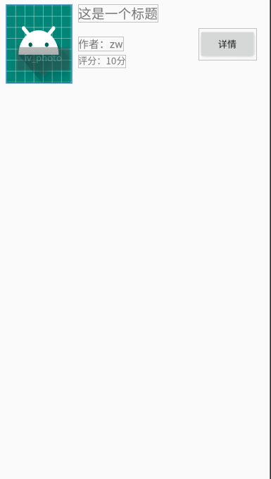

使用`ConstraintLayout`作为根布局，实现代码如下：

```xml
<?xml version="1.0" encoding="utf-8"?>
<androidx.constraintlayout.widget.ConstraintLayout xmlns:android="http://schemas.android.com/apk/res/android"
    xmlns:app="http://schemas.android.com/apk/res-auto"
    xmlns:tools="http://schemas.android.com/tools"
    android:layout_width="match_parent"
    android:layout_height="match_parent"
    tools:context=".RelativePosActivity">

    <ImageView
        android:id="@+id/iv_photo"
        android:layout_width="100dp"
        android:layout_height="120dp"
        android:src="@mipmap/ic_launcher"
        android:scaleType="fitXY"
        app:layout_constraintLeft_toLeftOf="parent"
        app:layout_constraintTop_toTopOf="parent"
        android:layout_marginLeft="10dp"
        android:layout_marginTop="10dp"
        />

    <TextView
        android:layout_width="wrap_content"
        android:layout_height="wrap_content"
        android:text="这是一个标题"
        android:textSize="20sp"
        android:id="@+id/tv_title"
        app:layout_constraintLeft_toRightOf="@id/iv_photo"
        app:layout_constraintTop_toTopOf="parent"
        android:layout_marginLeft="10dp"
        android:layout_marginTop="10dp"/>

    <TextView
        android:layout_width="wrap_content"
        android:layout_height="wrap_content"
        android:textSize="16sp"
        android:text="作者：zw"
        android:id="@+id/tv_author"
        app:layout_constraintLeft_toLeftOf="@id/tv_title"
        app:layout_constraintTop_toTopOf="@id/tv_title"
        app:layout_constraintBottom_toBottomOf="@id/iv_photo"/>

    <TextView
        android:layout_width="wrap_content"
        android:layout_height="wrap_content"
        android:text="评分：10分"
        android:textSize="14sp"
        android:id="@+id/tv_rating"
        app:layout_constraintTop_toBottomOf="@id/tv_author"
        app:layout_constraintLeft_toLeftOf="@id/tv_author"
        android:layout_marginTop="5dp"
        />

    <Button
        android:id="@+id/btn_detail"
        android:layout_width="wrap_content"
        android:layout_height="wrap_content"
        app:layout_constraintRight_toRightOf="parent"
        app:layout_constraintTop_toTopOf="@id/iv_photo"
        app:layout_constraintBottom_toBottomOf="@id/iv_photo"
        android:layout_marginRight="20dp"
        android:text="详情"/>

</androidx.constraintlayout.widget.ConstraintLayout>
```

布局分析：
1、先看`ImageView`，使用了如下两个ConstraintLayout的属性

```xml
app:layout_constraintLeft_toLeftOf="parent"
app:layout_constraintTop_toTopOf="parent"
```

其中：
`layout_constraintLeft_toLeftOf`表示ImageView的左侧与谁的左侧对齐，这里可以选择id（表示和某View的左侧对齐），也可以选择parent，表示和父布局的左侧对齐；
`layout_constraintTop_toTopOf`相似，表示ImageView的上面和谁的上面对齐。
2、再看TextView——“这是一个标题”，用到的属性有：

```xml
app:layout_constraintLeft_toRightOf="@id/iv_photo"
app:layout_constraintTop_toTopOf="parent"
```

其中`layout_constraintLeft_toRightOf`表示，TextView的左侧与谁的右侧对齐。代码中所写为与ImageView的右侧对齐，也就是此TextView的左侧在ImageView的右侧。

3、再看TextView——“作者”,用到的属性：

```xml
app:layout_constraintLeft_toLeftOf="@id/tv_title"
app:layout_constraintTop_toTopOf="@id/tv_title"
app:layout_constraintBottom_toBottomOf="@id/iv_photo"
```

其中，值得注意的是，`layout_constraintTop_toTopOf`和`layout_constraintBottom_toBottomOf`一起使用，由于`tv_title`顶部和`iv_photo`一致，因此此`TextView`可理解为顶部与`iv_photo`的顶部对齐，底部与`iv_photo`的底部对齐。
但由于此`TextView`的高度为`WRAP_CONTENT`,因此它的高度并非被拉长，而是被居中了！

类似的属性还有很多，有了上面的示例参考，理解起来应该不难。

```shell
sanlayout_constraintLeft_toLeftOf
layout_constraintLeft_toRightOf
layout_constraintRight_toLeftOf
layout_constraintRight_toRightOf
layout_constraintTop_toTopOf
layout_constraintTop_toBottomOf
layout_constraintBottom_toTopOf
layout_constraintBottom_toBottomOf
layout_constraintBaseline_toBaselineOf
layout_constraintStart_toEndOf
layout_constraintStart_toStartOf
layout_constraintEnd_toStartOf
layout_constraintEnd_toEndOf
```

# 三、bias（偏移比例）

实现如下效果

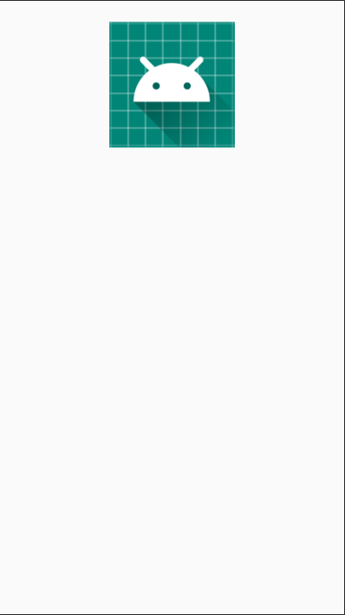

```shell
app:layout_constraintRight_toRightOf="parent"
app:layout_constraintTop_toTopOf="parent"
```

那么为什么这样写，就会居中呢？是因为布局中有一个默认属性`layout_constraintHorizontal_bias`，此属性为偏移比例，默认值为0.5(取值区间0-1)，因此，会达到居中的效果。
当我们给如上布局增加一个属性：`app:layout_constraintHorizontal_bias="0.2"`，看一下效果：

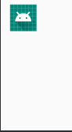

可以看见，它向左倾斜了，倾斜比例为0.2。
类似的，还有垂直的偏移比例属性：`layout_constraintVertical_bias`。

* 注：此属性必须要在有约束力的前提下，才能生效。单独使用无效果。*

# 四、ratio（布局比例）

使用此属性的前提是：* 控件的宽度或高度必须有一个属性为0dp才有效果。*

有时候，当我们知道宽度或高度的具体长度时，需要对应的高度或宽度和它形成等比例长度，这个时候，我们就可以用到此属性。

1、比如，我们有一个需求，需要图片的宽高比为16:9,此时，就可以运用此属性：`layout_constraintDimensionRatio`。

先看代码：

```xml
<ImageView
    android:id="@+id/iv_photo"
    android:layout_width="match_parent"
    android:layout_height="0dp"
    app:layout_constraintDimensionRatio="16:9"
    android:src="@mipmap/ic_launcher"
    android:scaleType="fitXY"
    app:layout_constraintTop_toTopOf="parent"
    app:layout_constraintLeft_toLeftOf="parent"
    />
```

其中，控件宽度与父布局相同，高度设置为0dp，宽高比例(`layout_constraintDimensionRatio`)为16:9，实现的效果：

2、比如我们知道此图片的宽度为100dp，需要此图片的高度为此图片的2倍，则代码可以写为：

```powershell
android:layout_width="100dp"
android:layout_height="0dp"
app:layout_constraintDimensionRatio="1:2"
```

layout_constraintDimensionRatio此属性默认是宽高比，如果需要高宽比，则可以写成如下形式：`app:layout_constraintDimensionRatio="H:1:2"`

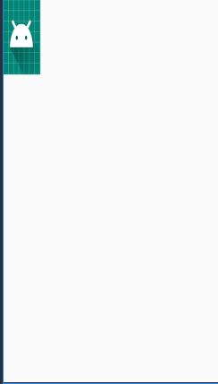

# 五、chains（链）

链有点类似于LinearLayout中的weight属性，但是比weight属性要强大，它至少需要有2个相互约束的布局，才能产生效果。

先让我们看以下代码，此代码中包括3个互相约束的TextView：

```xml
<?xml version="1.0" encoding="utf-8"?>
<androidx.constraintlayout.widget.ConstraintLayout xmlns:android="http://schemas.android.com/apk/res/android"
    xmlns:app="http://schemas.android.com/apk/res-auto"
    xmlns:tools="http://schemas.android.com/tools"
    android:layout_width="match_parent"
    android:layout_height="match_parent"
    tools:context=".ChainsActivity">

    <TextView
        android:id="@+id/tv1"
        android:layout_width="wrap_content"
        android:layout_height="wrap_content"
        android:background="#FF0000"
        android:text="tv1"
        android:padding="20dp"
        app:layout_constraintTop_toTopOf="parent"
        app:layout_constraintLeft_toLeftOf="parent"
        app:layout_constraintRight_toLeftOf="@id/tv2"
        />

    <TextView
        android:id="@+id/tv2"
        android:layout_width="wrap_content"
        android:layout_height="wrap_content"
        android:background="#00FF00"
        android:text="tv2"
        android:padding="20dp"
        app:layout_constraintTop_toTopOf="parent"
        app:layout_constraintLeft_toRightOf="@id/tv1"
        app:layout_constraintRight_toLeftOf="@id/tv3"
        />

    <TextView
        android:id="@+id/tv3"
        android:layout_width="wrap_content"
        android:layout_height="wrap_content"
        android:background="#0000FF"
        android:text="tv3"
        android:padding="20dp"
        app:layout_constraintTop_toTopOf="parent"
        app:layout_constraintRight_toRightOf="parent"
        app:layout_constraintLeft_toRightOf="@id/tv2"
        />

</androidx.constraintlayout.widget.ConstraintLayout>
```

效果图：

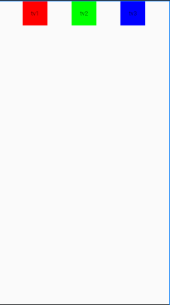

之所以出现上图所示的效果，是因为在每个TextView中，都有一个默认的属性：`app:layout_constraintHorizontal_chainStyle`，并且此属性的值为spread，当我们给tv1设置此属性值为packed时，效果如下：

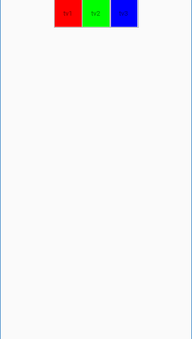

当此属性值设为packed时，还可以搭配bias来使用，比如将tv1的bias属性设置为app:layout_constraintHorizontal_bias="0.2"时，效果如下：

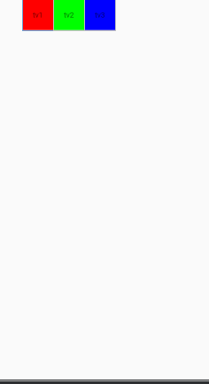

当我们将三个TextView的宽度设置为0dp时，可以使用layout_constraintHorizontal_weight属性来为每个控件按比例设置宽度，此时属性layout_constraintHorizontal_chainStyle失效，比如：

```xml
<?xml version="1.0" encoding="utf-8"?>
<androidx.constraintlayout.widget.ConstraintLayout xmlns:android="http://schemas.android.com/apk/res/android"
    xmlns:app="http://schemas.android.com/apk/res-auto"
    xmlns:tools="http://schemas.android.com/tools"
    android:layout_width="match_parent"
    android:layout_height="match_parent"
    tools:context=".ChainsActivity">

    <TextView
        app:layout_constraintHorizontal_chainStyle="packed"
        app:layout_constraintHorizontal_bias="0.2"
        android:id="@+id/tv1"
        android:layout_width="0dp"
        android:layout_height="wrap_content"
        android:background="#FF0000"
        android:text="tv1"
        android:padding="20dp"
        app:layout_constraintTop_toTopOf="parent"
        app:layout_constraintLeft_toLeftOf="parent"
        app:layout_constraintRight_toLeftOf="@id/tv2"
        app:layout_constraintHorizontal_weight="2"
        />

    <TextView
        android:id="@+id/tv2"
        android:layout_width="0dp"
        android:layout_height="wrap_content"
        android:background="#00FF00"
        android:text="tv2"
        android:padding="20dp"
        app:layout_constraintTop_toTopOf="parent"
        app:layout_constraintLeft_toRightOf="@id/tv1"
        app:layout_constraintRight_toLeftOf="@id/tv3"
        app:layout_constraintHorizontal_weight="1"
        />

    <TextView
        android:id="@+id/tv3"
        android:layout_width="0dp"
        android:layout_height="wrap_content"
        android:background="#0000FF"
        android:text="tv3"
        android:padding="20dp"
        app:layout_constraintTop_toTopOf="parent"
        app:layout_constraintRight_toRightOf="parent"
        app:layout_constraintLeft_toRightOf="@id/tv2"
        app:layout_constraintHorizontal_weight="1"
        />

</androidx.constraintlayout.widget.ConstraintLayout>
```

设置的三个TextView的比例为2:1:1，则实现效果为：


* 注意： *
上述例子中，设置chainStyle属性都是在tv1上，也就是互相约束布局的第一个View上设置才能生效！

# 六、Circular positioning（圆形定位）

这个不好用文字描述，直接上代码和效果图吧。
首先看我们的XML布局：

```xml
<?xml version="1.0" encoding="utf-8"?>
<androidx.constraintlayout.widget.ConstraintLayout xmlns:android="http://schemas.android.com/apk/res/android"
    xmlns:app="http://schemas.android.com/apk/res-auto"
    xmlns:tools="http://schemas.android.com/tools"
    android:layout_width="match_parent"
    android:layout_height="match_parent"
    tools:context=".CircularPosActivity">
    <Button
        android:id="@+id/btn_a"
        android:layout_width="wrap_content"
        android:layout_height="wrap_content"
        android:text="A"
        app:layout_constraintLeft_toLeftOf="parent"
        app:layout_constraintRight_toRightOf="parent"
        app:layout_constraintTop_toTopOf="parent"
        app:layout_constraintBottom_toBottomOf="parent"/>

    <Button
        android:layout_width="wrap_content"
        android:layout_height="wrap_content"
        android:text="B"
        app:layout_constraintCircle="@id/btn_a"
        app:layout_constraintCircleRadius="100dp"
        app:layout_constraintCircleAngle="45"
        />

</androidx.constraintlayout.widget.ConstraintLayout>
```

其中，按钮A是在屏幕中间显示，按钮B的坐标依赖于A，效果图：

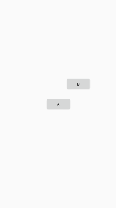


B之所以会显示在那里，依赖于如下三个属性：
`app:layout_constraintCircle`：你的圆形定位将相对于哪个View来显示。
`layout_constraintCircleRadius`：你的圆形定位相对于View的半径（负数无效）。
`layout_constraintCircleAngle`：圆形定位偏移的角度（正负值无关系），顺时针计算。

其中，B的中心点在相对于A半径100，偏移角度为45°的位置上。

**WRAP_CONTENT约束性失效问题**
在1.1.0版本之前，WRAP_CONTENT属性可能存在约束性失效的问题。
举个例子，如下的布局：

```xml
<android.support.constraint.ConstraintLayout xmlns:android="http://schemas.android.com/apk/res/android"
    xmlns:app="http://schemas.android.com/apk/res-auto"
    xmlns:tools="http://schemas.android.com/tools"
    android:layout_width="match_parent"
    android:layout_height="match_parent"
    tools:context=".ConsActivity">

    <Button
        android:id="@+id/btn_a"
        android:layout_width="wrap_content"
        android:layout_height="wrap_content"
        app:layout_constraintLeft_toLeftOf="parent"
        app:layout_constraintTop_toTopOf="parent"
        android:text="AAAAAAAAAAA"/>

    <Button
        android:id="@+id/btn_b"
        android:layout_width="wrap_content"
        android:layout_height="wrap_content"
        app:layout_constraintLeft_toRightOf="@id/btn_a"
        app:layout_constraintRight_toRightOf="parent"
        app:layout_constraintTop_toBottomOf="@id/btn_a"
        android:text="BBBBBBBBBB"/>
</android.support.constraint.ConstraintLayout>
```

若此时按钮B的文字变长，超过了约束布局的长度，则约束布局会失效：

此时，`app:layout_constrainedWidth="true"`属性就会起作用，约束此布局不会超过它规定的长度。

# 七、百分比布局

`ConstraintLayout`的一大特色就是可以实现百分比布局，由于ConstraintLayout解决了布局嵌套问题，因此`ConstraintLayout中MATCH_PARENT`属性用的较少。
当我们有一个需求：需要一个按钮，此按钮宽度占屏幕一半时，此时，用`ConstraintLayout`的百分比布局法可以轻松解决这个问题。
代码如下所示：

```xml
<Button
    android:layout_width="0dp"
    android:layout_height="wrap_content"
    app:layout_constraintLeft_toLeftOf="parent"
    app:layout_constraintRight_toRightOf="parent"
    app:layout_constraintWidth_percent="0.5"
    android:text="BTN"/>
```

如果需要对此按钮的最大宽度或者最小宽度有要求的话，还可以添加如下两个属性来实现：

```xml
app:layout_constraintWidth_max="200dp"
app:layout_constraintWidth_min="100dp"
```

# 八、隐藏边距
如果按钮B约束在按钮A的右边，则当A的android:visibility属性设置为gone时，B会往左移动到A的位置上，此时如果需要设置一个相对于左侧的距离，则可以使用属性goneMargin来实现：

```xml
<Button
    android:layout_width="0dp"
    android:layout_height="wrap_content"
    app:layout_constraintLeft_toLeftOf="parent"
    app:layout_constraintRight_toRightOf="parent"
    app:layout_constraintWidth_percent="0.5"
    android:text="BTN"/>
```

# 九、辅助布局Guideline

`Guideline`可以设置类似于LinearLayout中的`orientation`属性，设置垂直方向或者水平方向，若设置垂直方向，则水平方向的高度为0，若设置为水平方向，则垂直方向的宽度为0。
Guideline有以下三种定位方式：

- layout_constraintGuide_begin：距离父容器起始位置的距离（左侧或顶部）；
- layout_constraintGuide_end： 距离父容器结束位置的距离（右侧或底部）；
- layout_constraintGuide_percent： 距离父容器宽度或高度的百分比。

如果有一个需求，横向的两个按钮，分别占据屏幕一半的中央，则此时用Guideline可以轻松实现此效果。

```xml
<?xml version="1.0" encoding="utf-8"?>
<androidx.constraintlayout.widget.ConstraintLayout xmlns:android="http://schemas.android.com/apk/res/android"
    xmlns:app="http://schemas.android.com/apk/res-auto"
    xmlns:tools="http://schemas.android.com/tools"
    android:layout_width="match_parent"
    android:layout_height="match_parent"
    tools:context=".GuideActivity">

     <androidx.support.constraint.Guideline
        android:id="@+id/guide_line"
        android:layout_width="wrap_content"
        android:layout_height="wrap_content"
        android:orientation="vertical"
        app:layout_constraintGuide_percent="0.5"
        />

    <Button
        android:layout_width="wrap_content"
        android:layout_height="wrap_content"
        app:layout_constraintLeft_toLeftOf="parent"
        app:layout_constraintRight_toLeftOf="@id/guide_line"
        android:text="A"
        android:id="@+id/btn_a"/>

    <Button
        android:layout_width="wrap_content"
        android:layout_height="wrap_content"
        app:layout_constraintLeft_toRightOf="@id/guide_line"
        app:layout_constraintRight_toRightOf="parent"
        android:text="B"
        android:id="@+id/btn_b"/>

</androidx.constraintlayout.widget.ConstraintLayout>
```

效果图（图中标红的框内就是Guideline）：

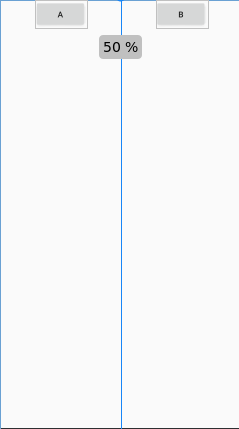

# 十、辅助布局Barrier

Barrier，直译为障碍、屏障。在约束布局中，可以使用属性constraint_referenced_ids属性来引用多个带约束的组件，从而将它们看作一个整体。

例如，当前布局如下，TextView（I Love Android）被约束在TextView（姓名）的右边，并且效果不错：

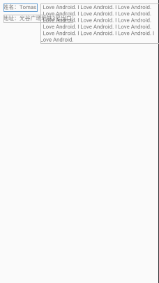

代码如下：

```xml
<?xml version="1.0" encoding="utf-8"?>
<androidx.constraintlayout.widget.ConstraintLayout xmlns:android="http://schemas.android.com/apk/res/android"
    xmlns:app="http://schemas.android.com/apk/res-auto"
    xmlns:tools="http://schemas.android.com/tools"
    android:layout_width="match_parent"
    android:layout_height="match_parent"
    tools:context=".BarrierActivity">

    <TextView
        android:id="@+id/tv1"
        android:text="姓名：Tomas"
        android:layout_width="wrap_content"
        android:layout_height="wrap_content"
        app:layout_constraintLeft_toLeftOf="parent"
        app:layout_constraintTop_toTopOf="parent"
        android:layout_marginLeft="10dp"
        android:layout_marginTop="10dp"/>

    <TextView
        android:id="@+id/tv2"
        android:layout_width="wrap_content"
        android:layout_height="wrap_content"
        android:text="地址：光谷广场地铁3号出口"
        app:layout_constraintTop_toBottomOf="@id/tv1"
        app:layout_constraintLeft_toLeftOf="@id/tv1"
        android:layout_marginTop="10dp"
        />

    <TextView
        android:id="@+id/tv3"
        android:layout_width="wrap_content"
        android:layout_height="wrap_content"
        android:text="I Love Android. I Love Android. I Love Android. I Love Android. I Love Android. I Love Android. I Love Android. I Love Android. I Love Android. I Love Android. I Love Android. I Love Android. I Love Android. I Love Android. I Love Android. I Love Android. "
        app:layout_constraintLeft_toRightOf="@id/tv1"
        app:layout_constraintRight_toRightOf="parent"
        app:layout_constrainedWidth="true"
        app:layout_constraintTop_toTopOf="@id/tv1"
        android:layout_marginLeft="10dp"
        />
</androidx.constraintlayout.widget.ConstraintLayout>
```


但是，如果此刻TextView（地址）有一串很长的地址，则它就会和TextView（I Love Android）产生重合。

此时，如果用Barrier就会有很直观的效果。

代码：

```xml
<?xml version="1.0" encoding="utf-8"?>
<androidx.constraintlayout.widget.ConstraintLayout xmlns:android="http://schemas.android.com/apk/res/android"
    xmlns:app="http://schemas.android.com/apk/res-auto"
    xmlns:tools="http://schemas.android.com/tools"
    android:layout_width="match_parent"
    android:layout_height="match_parent"
    tools:context=".BarrierActivity">

   <TextView
        android:id="@+id/tv1"
        android:text="姓名：Tomas"
        android:layout_width="wrap_content"
        android:layout_height="wrap_content"
        app:layout_constraintLeft_toLeftOf="parent"
        app:layout_constraintTop_toTopOf="parent"
        android:layout_marginLeft="10dp"
        android:layout_marginTop="10dp"/>

    <TextView
        android:id="@+id/tv2"
        android:layout_width="wrap_content"
        android:layout_height="wrap_content"
        android:text="地址：光谷广场地铁3号出口"
        app:layout_constraintTop_toBottomOf="@id/tv1"
        app:layout_constraintLeft_toLeftOf="@id/tv1"
        android:layout_marginTop="10dp"
        />

    <TextView
        android:id="@+id/tv3"
        android:layout_width="wrap_content"
        android:layout_height="wrap_content"
        android:text="I Love Android. I Love Android. I Love Android. I Love Android. I Love Android. I Love Android. I Love Android. I Love Android. I Love Android. I Love Android. I Love Android. I Love Android. I Love Android. I Love Android. I Love Android. I Love Android. "
        app:layout_constraintLeft_toRightOf="@id/barrier"
        app:layout_constraintRight_toRightOf="parent"
        app:layout_constrainedWidth="true"
        app:layout_constraintTop_toTopOf="@id/tv1"
        android:layout_marginLeft="10dp"
        />

    <androidx.constraintlayout.widget.Barrier
        android:id="@+id/barrier"
        android:layout_width="wrap_content"
        android:layout_height="wrap_content"
        app:barrierDirection="right"
        app:constraint_referenced_ids="tv1,tv2"
        tools:ignore="MissingConstraints" />
</androidx.constraintlayout.widget.ConstraintLayout>
```

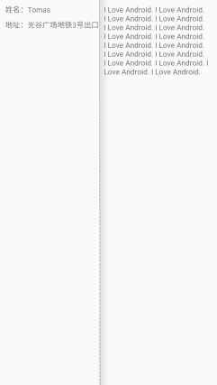

增加一个Barrier，并且设置`barrierDirection`为`right`，并且用`constraint_referenced_ids`将它关联的控件Id放在一起，最后让TextView（I Love Android）以此Barrier为依赖。

# 十一、Group设置可见性
Group较简单，用于控件们的可见性。

```xml
<android.support.constraint.Group
    android:layout_width="wrap_content"
    android:layout_height="wrap_content"
    android:visibility="visible"
    app:constraint_referenced_ids="tv1,tv2"
    />
```

其中，`constraint_referenced_ids`选择需要成为一组的控件，visibility设置它们的可见性。